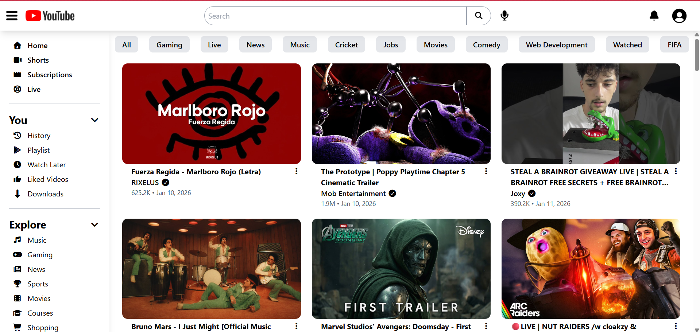
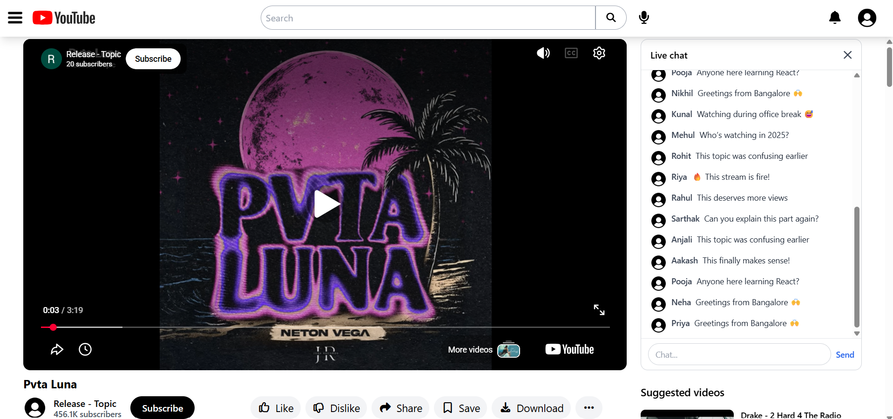

# 🎥 YouTube-Inspired Video Streaming Platform


A production-style frontend video streaming platform inspired by YouTube, built using React, Redux Toolkit, Tailwind CSS, and Netlify Serverless Functions.

### The application recreates a modern video discovery experience with:

- dynamic video feeds
- responsive layouts
- watch-page architecture
- debounced search suggestions
- live chat simulation
- Redux-powered UI state management
- mobile-first responsive behavior

Designed to go beyond basic frontend projects by focusing on scalable component architecture, responsive UI systems, route-aware layouts, and production-oriented frontend engineering patterns.

------------------------------------------------------------------------

## 🌐 Live Demo

https://aarshyoutube.netlify.app/

------------------------------------------------------------------------

## ✨ Why This Project Stands Out

- Built a production-style YouTube-inspired streaming platform with responsive desktop/mobile layouts and adaptive watch-page architecture.
- Implemented debounced search suggestions with Redux-based caching optimization to reduce redundant API requests and improve performance.
- Developed dynamic UI systems including overlay/static sidebar behavior, responsive routing layouts, and realistic video browsing interactions.
- Focused on scalable frontend architecture, reusable component design, and production-oriented responsive engineering workflows

------------------------------------------------------------------------

## 🧠 Core Features

### 🎬 Video Feed System

- Dynamic home feed powered by YouTube Data API
- Responsive video grid rendering
- Optimized video card layouts
- Adaptive desktop/mobile experience
- YouTube-style browsing workflow

### 🔍 Smart Search System

- Debounced search suggestions
- Redux-based query caching
- Reduced redundant API calls
- Instant search dropdown rendering
- Dynamic search UX similar to YouTube

### 📺 Watch Page Experience

- Embedded YouTube video player
- Dynamic video metadata rendering
- Suggested videos section
- Responsive stacked mobile layout
- Route-based scroll restoration
- YouTube-inspired watch-page architecture

### 💬 Live Chat Simulation

- Simulated live chat stream with dynamic message rendering
- Redux-managed message stream
- Dynamic message rendering
- Collapsible mobile chat system
- Interactive live chat interface

### 🗨️ Nested Comments System

- Recursive nested comments rendering
- Expand/collapse replies
- Dynamic replies visibility
- Responsive comments layout
- YouTube-inspired threaded discussion UX

### 📱 Responsive Mobile Experience

- Mobile-first responsive rendering
- Sidebar overlay system on mobile
- Desktop static sidebar layout
- Adaptive watch-page stacking
- Responsive search/header behavior
- Optimized spacing and typography across devices

------------------------------------------------------------------------

## 🛠️ Tech Stack

React, React Router DOM, Redux Toolkit, Tailwind CSS, Netlify Functions, YouTube Data API

------------------------------------------------------------------------

## 📸 Screenshots

### 🏠 Home Feed
<p align="center">
  
</p>

> Responsive home feed with adaptive sidebar behavior and dynamic video rendering.

---

### 📺 Watch Page
<p align="center">
  
</p>

> Watch-page layout with embedded player, comments system, live chat simulation, and responsive suggestions panel.

------------------------------------------------------------------------

## 🚧 Future Improvements

- Infinite scrolling video feed
- YouTube Shorts-style vertical feed
- User authentication
- Personalized recommendations
- Real-time websocket live chat
- Video categories & filters
- Dark/light theme toggle

------------------------------------------------------------------------

## 📦 Project Structure

```text
My-Youtube/
├── netlify/
│   └── functions/
│       ├── search.js
│       └── videos.js
│
├── public/
│
├── src/
│   ├── components/
│   │   ├── comments/
│   │   ├── Body.jsx
│   │   ├── Head.jsx
│   │   ├── Sidebar.jsx
│   │   ├── VideoContainer.jsx
│   │   ├── WatchPage.jsx
│   │   └── ...
│   │
│   ├── redux/
│   │   ├── store.js
│   │   ├── appSlice.js
│   │   ├── searchSlice.js
│   │   └── chatSlice.js
│   │
│   ├── utils/
│   ├── App.js
│   └── index.js
│
├── netlify.toml
├── tailwind.config.js
├── package.json
└── README.md
```

------------------------------------------------------------------------

